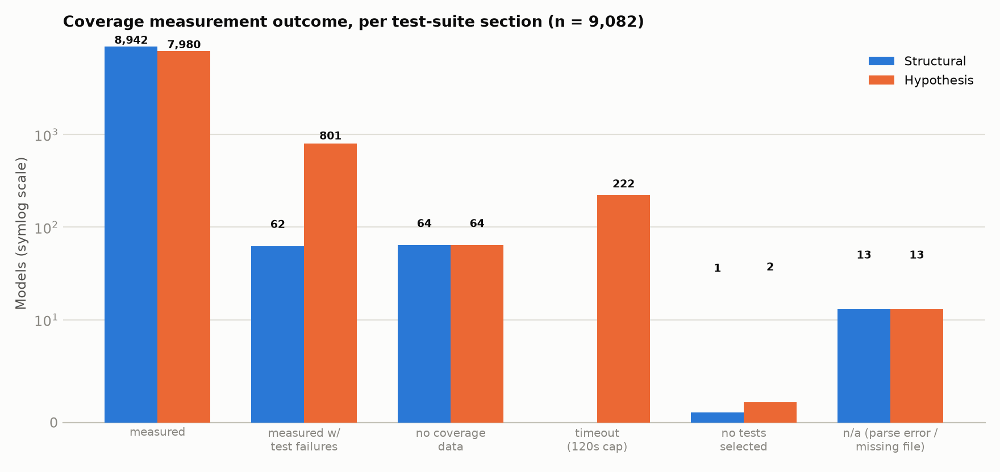
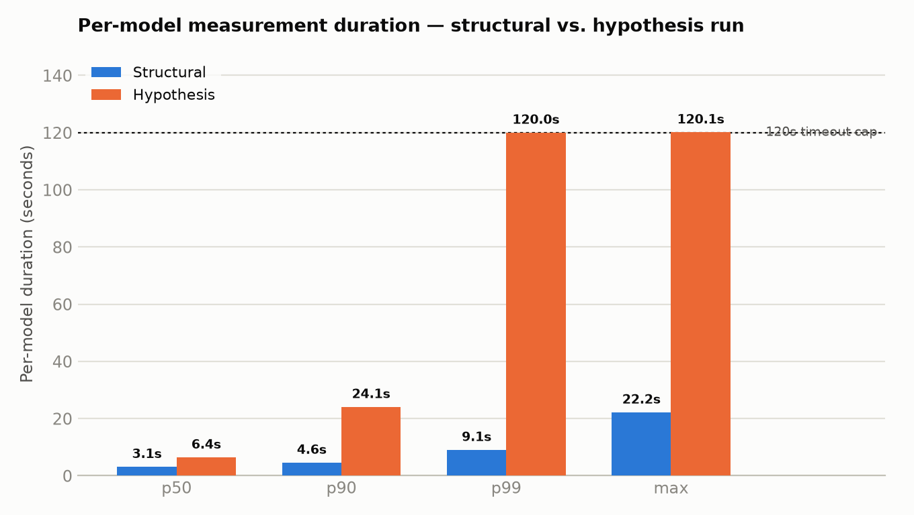

# Test Coverage Report

*Generated 2026-09-04. Covers the full-dataset coverage-by-section run introduced in
commit `92eed45453` ("test coverage"), which computed
`reports/coverage_split_prototype_report.{json,md}` across all 9,082 models. Script:
`scripts/validate_coverage_split.py`. Methodology background:
`docs/DECISIONS.md`, 2026-09-02 entry.*

## What this measures

Each model's generated `test_hypothesis.py` is split into two halves, separated via
pytest's automatic `hypothesis` marker (every `@given` test is auto-tagged, so
`pytest -m hypothesis` / `-m "not hypothesis"` cleanly separates them with no need
to parse test node IDs):

- **Structural** — `SECTION 1 — STRUCTURAL TESTS`, plain assertions against the
  generated code.
- **Hypothesis** — the `HYPOTHESIS STRATEGIES` half, property-based `@given` tests
  that fuzz inputs.

Line coverage (`pytest --cov --cov-report=json`) is run once per half, per model,
against `python_code.py`. For the hypothesis half, an **"implemented-only"**
variant additionally excludes lines belonging to "empty" generated `Operation`
methods (body is exactly one `pass` statement — no docstring, no
`NotImplementedError`, no bare `return`) from both the executed and total-statement
sets, so a trivially-executed stub can't inflate the score. The structural ratio is
never adjusted this way.

## Headline numbers

| Metric | Value |
|---|---|
| Models in dataset | 9,082 |
| Models with a coverage result (either half) | 9,069 (99.86%) — 12 `code_parse_error`, 1 `missing_file` |
| **Avg. structural coverage** | **48.04%** (8,942 measured) |
| **Avg. hypothesis coverage (raw)** | **75.12%** (7,980 measured) |
| **Avg. hypothesis coverage (implemented-only)** | **75.12%** (7,980 measured) |
| Models where empty-method exclusion changes the per-model score | 802 / 8,781 (9.1%) |
| Models with ≥1 empty (`pass`-stub) method | 1,037 / 9,082 (11.4%) — 21,229 stub methods total, max 308 in one model |

The implemented-only adjustment matters for individual models (9.1% of them shift)
but washes out in the dataset-wide average, which rounds to the same 75.12% either
way — stub methods are concentrated in a minority of models, not spread evenly.

**Structural** coverage is left-skewed and clusters around 30–40%, with a secondary
bump at 100% (models whose plain-assertion tests happen to exercise nearly
everything). **Hypothesis** coverage clusters much higher, around 60–75%, with a
large spike at 100% — a single `@given` strategy fuzzes many input combinations per
test, so it tends to walk more of the generated code per model than the fixed
structural assertions do.

## Measurement outcome, per section

Coverage couldn't be measured for every model/section combination — some test
suites don't collect any tests for a section, some coverage runs report no data,
and the hypothesis half in particular can time out under fuzzing:

| Status | Structural | Hypothesis |
|---|---|---|
| measured | 8,942 | 7,980 |
| measured_with_test_failures | 62 | 801 |
| no_coverage_data | 64 | 64 |
| timeout (120s cap) | 0 | 222 |
| no_tests_selected | 1 | 2 |
| n/a (parse error / missing file, top-level) | 13 | 13 |
| **Total** | **9,082** | **9,082** |

Two patterns stand out:

- **`measured_with_test_failures` is far more common on the hypothesis half**
  (801 vs. 62) — property-based tests fail their own assertions more often than
  the fixed structural ones, consistent with the `AssertionError`-dominated
  failures seen in the separate test-suite-validation report.
- **Only the hypothesis half times out** (222 models, at the 120-second cap) —
  structural tests never do. Fuzzing is inherently more expensive per test, as the
  duration data below confirms.

## Per-model measurement duration

| | Structural | Hypothesis |
|---|---|---|
| p50 | 3.1s | 6.4s |
| p90 | 4.6s | 24.1s |
| p99 | 9.1s | 120.0s |
| max | 22.2s | 120.1s |
| sum (CPU-time, all models) | 32,076s (~8.9h) | 121,025s (~33.6h) |

The hypothesis run costs roughly 3.8x the structural run in total CPU time, and its
tail is capped hard at the 120s timeout rather than tapering off — the p99 already
sits at the cap, meaning at least 1% of models (≈91) are timeout-bound rather than
naturally finishing near that duration.

## Key takeaways

1. **Hypothesis tests cover far more code than structural tests** (75% vs. 48% avg)
   — the property-based half of each generated test file is doing most of the
   coverage work; the plain-assertion structural half is comparatively thin.
2. **The gap is a real target for improvement, not noise.** With ~9,000 models
   producing stable coverage numbers, the ~27-point spread between structural and
   hypothesis coverage is consistent enough to act on — e.g. adding more
   structural assertions, or shifting more scenarios into the hypothesis half.
3. **Hypothesis coverage is the expensive half to measure.** 222 models hit the
   120s cap and ~34 CPU-hours went into this half alone across the dataset,
   against ~9 CPU-hours for structural — any future full-dataset re-run should
   budget for that asymmetry.
4. **Empty-method exclusion is a per-model correction, not a dataset-level one.**
   It changes the score for 9% of models but doesn't move the aggregate average,
   so per-model comparisons (not just the dataset mean) should use the
   implemented-only figure when stub-heavy models are in scope.

## Related reports

- `reports/coverage_split_prototype_report.{json,md}` — full per-model detail
  (this report's source data).
- `reports/coverage_prototype_report.{json,md}` — earlier 250-model prototype,
  unsplit (structural + hypothesis together), superseded by this full run.
- `reports/test_validation_report.{json,md}` — pass/fail outcome of the same test
  suites (not coverage, but the failure-type breakdown referenced above).
- `reports/summary_report.md` — cross-metric report incorporating this coverage
  data alongside conversion, code validation, model metadata, and mutation testing.
