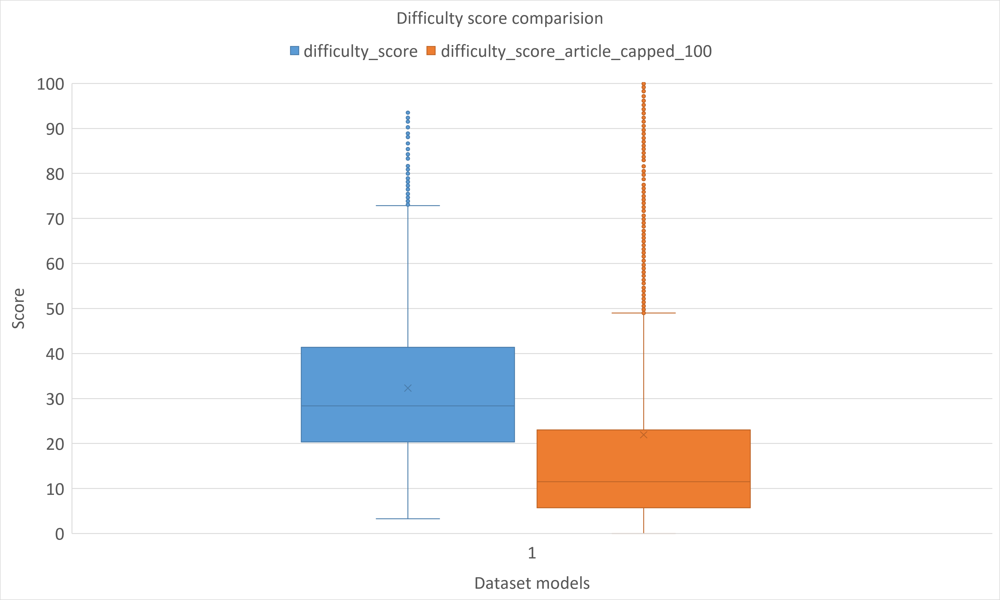
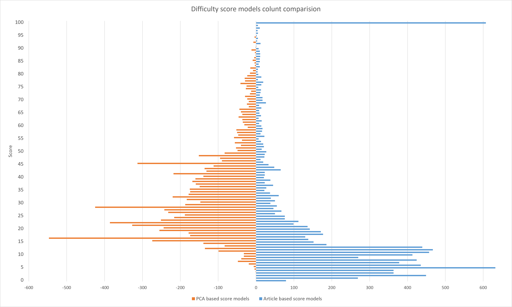

# BESSER-Dataset — Difficulty Score Report

*Generated 2026-09-17. Compares two per-model structural difficulty scores computed
over all 9,082 BUML models: a PCA-based score built for this dataset, and a
reproduction of a reference paper's linear formula. Source data:
`reports/difficulty_score_report.json`, `reports/difficulty_score_article_report.json`,
`reports/difficulty_score_comparison_report.json`; methodology notes:
`docs/DECISIONS.md` (2026-09-17 entries). Both scores are written per-model into every
`model_metadata.json`.*

## At a glance

| | PCA score (`difficulty_score`) | Article-formula score (`difficulty_score_article`) |
|---|---|---|
| Structural fields used | **11** (all non-constant structural counts) | **3** (classes, relationships, attributes) |
| Field weights | Learned from the data (PCA loadings) | Fixed by the paper (0.3571 / 0.4082 / 0.2347) |
| Handles outliers | Yes — log1p + standardization | No — linear in raw counts |
| Captures enumerations / methods / type diversity / multiplicity | Yes | No |
| Output range | Bounded, `[0, 100]` by construction | Unbounded (`[0.00, 931.36]` observed) |
| Determinism | Yes (`numpy.linalg.eigh`, no randomness) | Yes (closed-form) |

**Agreement between the two:** Pearson (linear) `r = +0.731`, Spearman (rank)
`ρ = +0.894`, top-10%-hardest overlap `75.6%` (686/908). The two broadly agree — but
where they disagree, it is systematic, not noise, and traces directly back to what
the article formula's 3 fixed variables cannot see (below).

---

## 1. Why two scores, and what each is trying to measure

Reference paper: Cheng, Y.; Huang, Y.; Yao, S.; Qian, Y.; Zhang, L.; Fang, X.; Wu, T.
"Large Language Models for UML Class Diagram Modeling: A Preliminary Empirical
Evaluation." *Applied Sciences* 2026, 16(13), 6540.
[10.3390/app16136540](https://doi.org/10.3390/app16136540).

A reference paper scores model difficulty as
`D = w_c*C + w_r*R + w_a*A + w_fk*FK`, where `C` = class count, `R` = relationship
complexity, `A` = attribute count, and `FK` = Flesch-Kincaid readability of the
natural-language requirement text. The paper's own weights are
`(0.35, 0.40, 0.23, 0.02)` — `FK`'s weight is small enough to be dropped, and the
rest rescaled to sum to 1: `w_c=0.3571, w_r=0.4082, w_a=0.2347`.

This dataset has no natural-language requirement text to compute `FK` from (models
are generated from BUML directly), so only the structural part is reproducible here.
Rather than assume the paper's fixed weights and 3 variables are the right lens for
*this* dataset, a second, independent score was built: a PCA-based score that starts
from every structural field this dataset actually has (11 fields, not 3) and lets the
data itself decide which fields matter and by how much, rather than hand-picking
which types of structure count toward "difficulty."

---

## 2. The PCA-based score (`difficulty_score`)

**Method:** for all 11 non-constant structural fields (`classes`, `attributes`,
`associations`, `composition`, `generalizations`, `abstract_classes`,
`enumerations`, `enumeration_literals`, `methods`, `many_valued_association_ends`,
`attribute_type_diversity`), apply `log1p` (dampens outlier influence), standardize
(z-score) across all 9,082 measured models, then run PCA (`numpy.linalg.eigh` on the
correlation matrix — deterministic, no randomness). Three fields
(`association_classes`, `abstract_methods`, `aggregation`) are confirmed true
constants (std = 0 across every model) and are excluded — a mathematical
requirement, not a judgment call.

**Two components combined**, not just the first:

| Component | Variance explained | What it represents |
|---|---|---|
| PC1 | 48.54% | Overall structural size/richness — every one of its 11 loadings is positive (range 0.13–0.36), so "more structure of any kind" pushes it up. |
| PC2 | 14.80% | A *style* axis, not a size axis — contrasts data-schema-heavy models (`attribute_type_diversity` +0.671, `attributes` +0.483) against hierarchy-heavy ones (`generalizations` -0.319, `abstract_classes` -0.257, `composition` -0.251). Verified empirically (not assumed) that both extremes of this axis are large, substantial models, not small ones drifting there by default. |

PC1 (signed) and `|PC2|` (unsigned — PC2's sign is mathematically arbitrary, so only
a symmetric function of it is meaningful) are each independently rescaled via
percentile-clip (1st/99th) + linear min-max to a point budget proportional to their
own variance explained — PC1 gets 76.64 of 100 points, PC2 gets 23.36 — and summed.
This bounds the final score to `[0, 100]` by construction while still reflecting how
much of the dataset's *real, measured* variation each axis explains.

**Result:** `difficulty_score` written for 9,082/9,082 models. Observed range
`[3.27, 93.55]`.

---

## 3. The article-formula score (`difficulty_score_article`)

`D = 0.3571*C + 0.4082*R + 0.2347*A`, applied directly to raw counts — no
standardization, no outlier dampening. `C = classes`, `A = attributes`, and
`R = associations + aggregation + composition + generalizations` (every separate
relationship type in this dataset's metamodel, counted once each; a paper-specified
`dependency` term is omitted since no `Dependency` class appears anywhere in this
dataset's BUML models).

**Result:** `difficulty_score_article` written for 9,082/9,082 models. Observed
range `[0.00, 931.36]`, mean `27.88` — unbounded and far more outlier-sensitive than
the PCA score, since nothing dampens a model with an extreme raw class count.

---

## 4. Head-to-head comparison

`scripts/compare_difficulty_scores.py` / `reports/difficulty_score_comparison_report.json`.

- **Pearson correlation:** `+0.731`
- **Spearman correlation:** `+0.894`
- **Top-10% ("hardest") overlap:** 686/908 models (**75.6%**)

The gap between Pearson and Spearman is itself informative: the two scores agree much
more on *ordering* than on raw linear value, which is expected — the article score's
unstandardized linearity makes it far more sensitive to a handful of extreme-count
outliers than the log1p + standardized PCA score is.

The PCA score's median (~28) sits well above the article score's (~11, capped at 100
for this comparison — see the note below the chart), and the article score's box is
compressed much closer to the bottom with a long tail of statistical "outliers" —
visually confirming the right-skew implied by the Pearson/Spearman gap above.

Binning both scores onto the same shared 0–100 axis makes the shape difference more
striking still: the article score (right, capped at 100) piles up overwhelmingly in the
0–15 range (400–600+ models per point near the bottom) and only separates the handful
of largest outliers, while the PCA score (left) spreads far more evenly across the full
range with a proper peak around 15–30 — i.e. the PCA score actually differentiates the
bulk of ordinary models, where the article score collapses most of them together.

*(The article score shown in both charts is capped — not rescaled — at 100:
`min(difficulty_score_article, 100)`. Capping only pulls in the small number of models
above 100 while leaving every other model's real value untouched, so the shape of the
bulk of the distribution is preserved for this comparison; the real, unbounded
`difficulty_score_article` value is unchanged in `model_metadata.json` and everywhere
else in this report. See `scripts/export_difficulty_scores_for_excel.py`.)*

### Where they disagree, and why

Two concrete cases from the 15 largest rank-percentile disagreements
(full list in the JSON report) show the disagreement is systematic, not random:

**Case A — enumeration-only models are invisible to the article formula.**

| Model | classes | attributes | associations/agg./comp./gen. | enumerations | enum. literals | PCA score (percentile) | Article score (percentile) |
|---|---|---|---|---|---|---|---|
| `model_3616` | 0 | 0 | 0 | 344 | 1,223 | **41.17** (75th) | **0.00** (0.2nd) |

`model_3616` is a pure enumeration model — 344 enumerations, 1,223 literals, nothing
else. `C`, `R`, and `A` are all exactly 0, so the article formula scores it 0
regardless of how large its enumeration structure is. The PCA score includes
`enumerations`/`enumeration_literals` as first-class fields (PC1 loadings +0.306 and
+0.326, comparable in magnitude to `classes`' +0.358) and correctly ranks it in the
75th percentile.

**Case B — raw class count over-rewards wide, structurally uniform models.**

| Model | classes | associations | generalizations | many-valued ends | attribute type diversity | PCA score (percentile) | Article score (percentile) |
|---|---|---|---|---|---|---|---|
| `model_10002872` | 41 | 18 | 0 | 0 | 1 | **15.32** (9.5th) | **22.46** (74.5th) |

41 classes drives `0.3571*41 ≈ 14.6` of the article score by itself — more than half
its total — despite the model having zero inheritance, zero multiplicity richness,
and only one attribute type in use anywhere. The PCA score weighs the raw class count
(log1p-dampened) against the model's near-total absence on every other dimension and
correctly places it near the bottom decile.

Both cases generalize: most of the biggest rank disagreements in the full report
follow one of these two shapes — a model whose complexity is concentrated in a field
the article formula ignores entirely (enumerations, methods, type diversity,
multiplicity), or a model whose raw class/attribute/relationship count is high but
otherwise structurally simple, which the article formula's linearity cannot discount
the way PCA's standardization does.

---

## 5. Why the PCA score is the more accurate measure of difficulty

1. **The article formula produces scores with no interpretable relationship to its own
   difficulty scale once applied to a genuinely large model — confirmed by the paper's
   own text, not an artifact of our reproduction.** Its Section 3.1.2 states explicitly:
   *"We retain original raw-data weighting without normalization, as primitive
   numerical features carry inherent domain semantics for UML difficulty
   evaluation."* The paper's own benchmark is 30 hand-picked textbook exercises
   with class counts of 4–13 and relationship counts of 3–16 (its Table 1) — nothing
   close to this dataset's largest real models. Applied to `model_2023` (a genuine
   932-class fUML trace metamodel: 836 associations, 292 composition, 332
   generalizations, `R = 1460`), the formula gives:

   | Term | Value | Contribution | Share |
   |---|---|---|---|
   | `0.3571 * C` | C=932 | 332.86 | 35.75% |
   | `0.4082 * R` | R=1460 | 595.92 | 63.99% |
   | `0.2347 * A` | A=11 | 2.58 | 0.28% |
   | **Total D** | | **931.36** | |

   The paper's own Table 2 reports its *hard*-tier average as `C=9.6, R=12.0, A=23.8`,
   which recomputes to `D ≈ 13.9` under the same weights. `model_2023` scores **~67×**
   that — not because it is 67× harder in any meaningful sense, but because `R` and `C`
   are raw, unbounded counts and nothing in the formula limits how much a single
   outlier can dominate the total once applied outside the small, uniform scale it was
   calibrated on. The same model scores a bounded, sensible `86.66` under the PCA
   score — near the top of `[0, 100]`, correctly flagged as one of the hardest models,
   but not mathematically disconnected from every other model's score the way `931.36`
   is. This is not a bug in either the paper or our reproduction; it's what happens
   when an unnormalized formula calibrated on 30 small exercises is applied to a
   dataset spanning orders of magnitude more structural variation.
2. **It uses all the structural information this dataset actually has.** The article
   formula was designed around 4 variables chosen for a different dataset with
   requirement-text readability available; applied here, 3 of this dataset's 11
   meaningful structural dimensions (enumerations, methods, type diversity,
   multiplicity) are entirely absent from it, not just down-weighted. The PCA score
   includes all 11 and lets their real, measured contribution (via PCA loadings)
   determine their weight — nothing is assumed to be irrelevant in advance.
3. **Its weights come from this dataset, not a different one.** The article's
   `(0.3571, 0.4082, 0.2347)` weights were fit for the paper's own dataset and
   requirement-text signal; there's no reason to expect them to transfer to a
   BUML-generated dataset with a different structural profile. PCA's loadings are
   derived from this dataset's actual covariance structure every time it's run.
4. **It is robust to outliers by construction.** `log1p` + standardization + a
   percentile-clip rescale bound the score's sensitivity to the dataset's most
   extreme models (some with thousands of classes); the article formula's raw
   linear sum has no such protection, which is visible directly in the Pearson/
   Spearman gap above.
5. **The disagreements are explainable, not arbitrary.** Both worked examples above
   show the PCA score correcting a specific, identifiable blind spot in the article
   formula (enumeration-blindness, raw-count-without-context) rather than just
   producing a different number for unclear reasons — which is what "more accurate"
   should mean in practice, not merely "different."
6. **Still broadly consistent with the article formula (`ρ = 0.894`).** The PCA score
   isn't measuring something unrelated — it agrees with the article formula on
   overall ordering for the large majority of models, and only diverges where the
   article formula's narrower design demonstrably misses real structure.

---

## Source reports

| Report | Scope | Files |
|---|---|---|
| PCA-based difficulty score | 9,082 (full) | `difficulty_score_report.json` |
| Article-formula difficulty score | 9,082 (full) | `difficulty_score_article_report.json` |
| Score comparison | 9,082 (full) | `difficulty_score_comparison_report.json` |
| Model structure metadata (input to both scores) | 9,082 (full) | `model_metadata_report.{json,md}` |

See `docs/DECISIONS.md` (2026-09-17 entries) for the full methodology discussion
behind both scores, including why PC2 is folded in via absolute value, why weights
are variance-proportional rather than an arbitrary split, and why the article
formula's `R` term must sum all four separate relationship-type fields.
