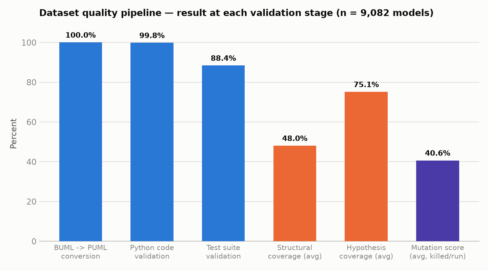
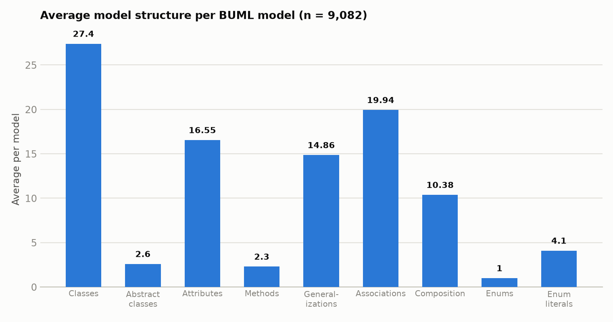
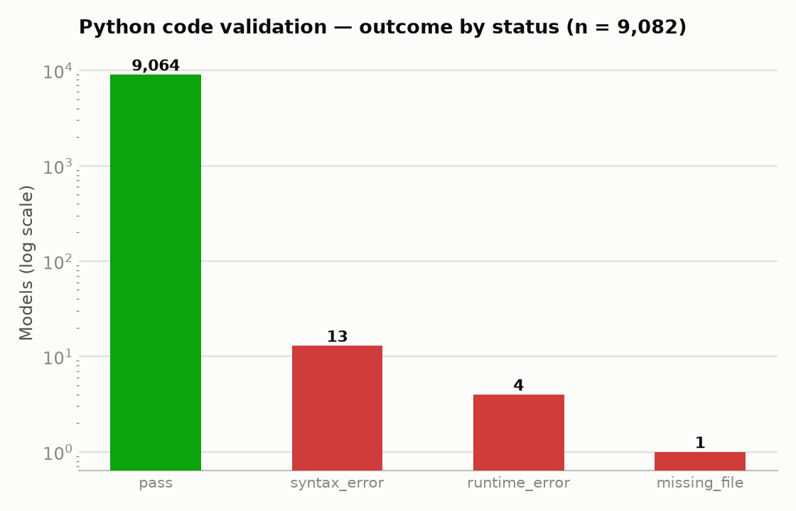
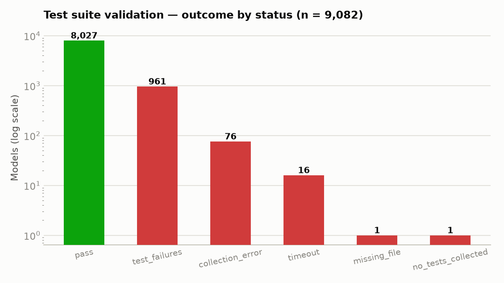
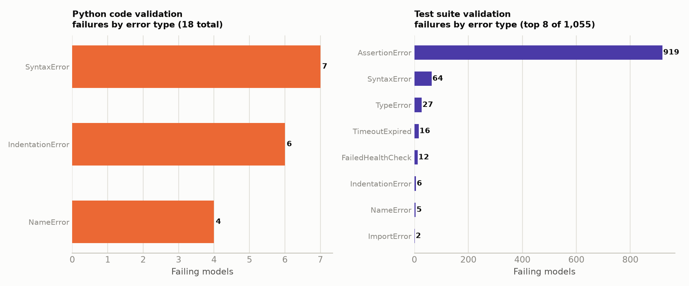
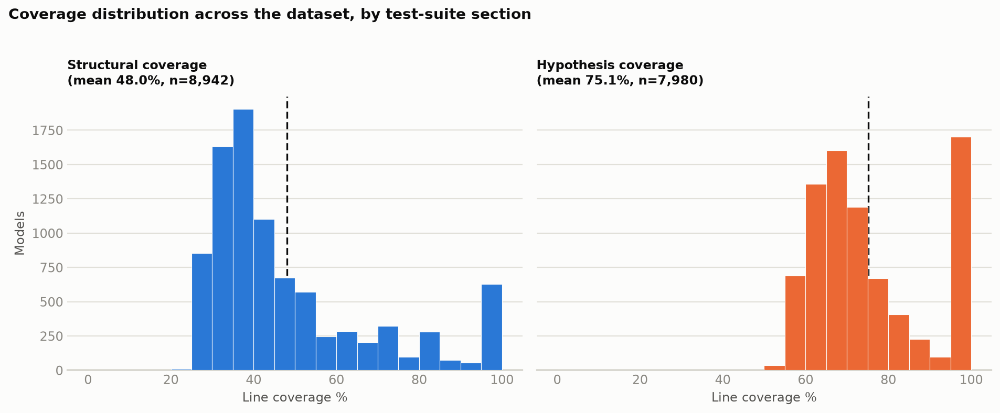
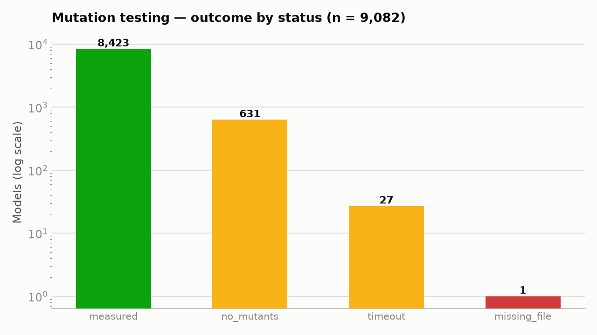
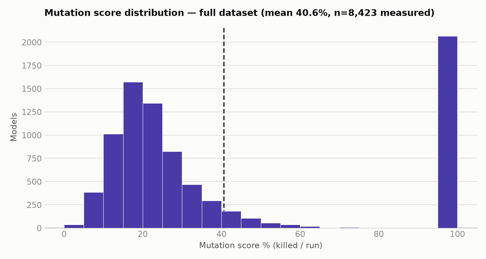

# BESSER-Dataset — Consolidated Quality Report

*Generated 2026-09-04. Consolidates every validation pass run against the full dataset:
BUML→PUML conversion, model-structure metadata, Python code validation, generated
test-suite validation, coverage (structural vs. hypothesis), and mutation testing.
Source data: the individual reports in `reports/*.json` / `reports/*.md`; methodology
notes: `docs/DECISIONS.md`.*

## Dataset at a glance

| | |
|---|---|
| Models in dataset | **9,082** |
| BUML → PUML conversion | **100%** converted (9,082 / 9,082) |
| Python code compiles & runs | **99.80%** pass (9,064 / 9,082) |
| Generated test suite passes in full | **88.38%** pass (8,027 / 9,082) |
| Individual tests collected | **1,298,863** (98.99% passed, 76 errored) |
| Avg. structural-test coverage | **48.04%** (9,004 / 9,082 measured) |
| Avg. hypothesis-test coverage | **75.12%** (8,781 / 9,082 measured) |
| Avg. mutation score (killed/run) | **40.62%** (8,423 / 9,082 measured, full-dataset run) |

Each model in the dataset is a BUML class model plus generated PlantUML, generated
Python code, and a generated `test_hypothesis.py` (a structural half exercising
plain assertions, and a hypothesis-strategies half using property-based `@given`
tests — see `docs/DECISIONS.md`, 2026-09-02 entry).

The pipeline is intentionally read left-to-right as a funnel of increasingly strict
checks: converting and *compiling* the generated code is close to universal, whether
the generated *tests* fully pass drops to ~88%, and the two coverage/mutation
metrics — which only apply to code the test suite actually exercises — sit
meaningfully lower, indicating real headroom in how thoroughly the generated tests
probe the generated implementations.

---

## 1. Model structure metadata

Computed by `scripts/generate_model_metadata.py` over all 9,082 BUML sources
(`reports/model_metadata_report.{json,md}`; per-model detail also written to each
model's own `model_metadata.json`).

| Field | Average per model |
|---|---|
| Classes | 27.4 |
| Abstract classes | 2.6 |
| Association classes | 0.0 |
| Enumerations | 1.0 |
| Enumeration literals | 4.1 |
| Attributes | 16.55 |
| Methods | 2.3 |
| Abstract methods | 0.0 |
| Generalizations | 14.86 |
| Associations | 19.94 |
| Aggregation | 0.0 |
| Composition | 10.38 |

The dataset's models are, on average, fairly large (27 classes each) and
relationship-heavy (associations + generalizations + composition together average
~45 relations per model against 27 classes), while methods with actual behavior are
sparse (2.3/model) — most of a model's logic lives in structure, not operations,
which is consistent with the low count of `abstract_methods` (0.0 avg) and the
"empty-method" `pass`-stub pattern noted in coverage methodology below.

---

## 2. BUML → PUML conversion

`scripts/buml_to_puml.py` / `reports/buml_to_puml_report.{json,md}`.

- **Total models:** 9,082 — **all converted**, 0 failures.
- **Duration:** p50 0.016s, p90 0.031s, max 2.109s per model.

A clean, fast, unconditional pass — no chart needed beyond the pipeline overview above.

---

## 3. Python code validation

Does each model's generated `python_code.py` actually compile and execute?
`scripts/validate_python_code.py` / `reports/python_code_validation_report.{json,md}`.

- **Passed:** 9,064 / 9,082 (**99.80%**)
- **Failed:** 18 total — 13 `syntax_error`, 4 `runtime_error`, 1 `missing_file`

**Failing models by error type:**

| Error type | Count |
|---|---|
| SyntaxError | 7 |
| IndentationError | 6 |
| NameError | 4 |

Full per-model detail: `reports/python_code_validation_report.json`, and each
failing model's `code_metadata.json`.

---

## 4. Generated test-suite validation

Does each model's `test_hypothesis.py` collect and pass in full against the
generated code? `scripts/validate_tests.py` /
`reports/test_validation_report.{json,md}`.

- **Models with a fully passing test suite:** 8,027 / 9,082 (**88.38%**)
- **Models with a failing/broken test suite:** 1,055
- **Individual tests:** 1,298,863 collected · 1,285,708 passed (98.99%) · 13,079 failed · 76 errored

| Status | Count |
|---|---|
| pass | 8,027 |
| test_failures | 961 |
| collection_error | 76 |
| timeout | 16 |
| missing_file | 1 |
| no_tests_collected | 1 |

**Failing models by error type** (also plotted against Python-validation errors below):

| Error type | Count |
|---|---|
| AssertionError | 919 |
| SyntaxError | 64 |
| TypeError | 27 |
| TimeoutExpired | 16 |
| hypothesis.errors.FailedHealthCheck | 12 |
| IndentationError | 6 |
| NameError | 5 |
| ImportError | 2 |
| hypothesis.errors.InvalidArgument | 1 |
| AttributeError | 1 |

`AssertionError` dominates test failures by a wide margin (919 of 1,055 failing
models, ~87%) — these are models whose generated tests run but disagree with the
generated implementation's actual behavior, not infrastructure or environment
failures.

---

## 5. Coverage — structural vs. hypothesis tests

`test_hypothesis.py` is split into two halves (separated via pytest's automatic
`hypothesis` marker): **structural** tests (plain assertions) and **hypothesis**
tests (property-based `@given` strategies). Coverage is measured separately for
each half so the two testing styles can be compared, and for the hypothesis half,
lines belonging to "empty" (single-`pass`-body) generated `Operation` methods are
excluded from both numerator and denominator so a trivially-executed stub can't
inflate the score (see `docs/DECISIONS.md`, 2026-09-02 entry for the exact
methodology). This full 9,082-model run supersedes the earlier 250-model
`coverage_prototype_report` (75.76% avg line coverage on an unsplit test run).

`scripts/validate_coverage_split.py` / `reports/coverage_split_prototype_report.{json,md}`.

- **Avg. structural coverage:** 48.04% (9,004 / 9,082 measured)
- **Avg. hypothesis coverage (raw):** 75.12% (8,781 / 9,082 measured)
- **Avg. hypothesis coverage (implemented-only, empty methods excluded):** 75.12% (identical to raw — empty-method lines rarely affected the measured sample)

| Status | Count |
|---|---|
| measured | 9,069 |
| code_parse_error | 12 |
| missing_file | 1 |

The two distributions tell different stories: **structural** coverage is
left-skewed and clusters around 30–40%, with a secondary bump at 100% (models whose
plain-assertion tests exercise nearly everything). **Hypothesis** coverage clusters
higher, around 60–75%, with a large spike at 100% — property-based `@given` tests
tend to walk more of the generated code per model than the fixed structural
assertions do, which is expected since a single hypothesis strategy fuzzes many
input combinations per test.

---

## 6. Mutation testing

Uses `cosmic-ray` with a per-model mutant cap; a mutant is "killed" if the existing
test suite catches the injected fault. `scripts/validate_mutation.py`. This
**full-dataset run** (`reports/mutation_full_dataset_report.{json,md}`) supersedes
the earlier 250-model prototype (`mutation_prototype_report`, avg score 33.05%).

- **Total models checked:** 9,082
- **Measured successfully:** 8,423 (**92.7%**)
- **Average mutation score (killed / run):** **40.62%**
- **Total mutants generated (uncapped), across dataset:** 2,856,242
- **Total mutants actually run (post-cap):** 300,650
- **Duration (init+exec):** p50 55.8s · p90 125.4s · p99 427.9s · max 929.1s · total 631,438.6s (~175 CPU-hours)

| Status | Count |
|---|---|
| measured | 8,423 |
| no_mutants | 631 |
| timeout | 27 |
| missing_file | 1 |

A 40.6% average mutation score against 75–100% line coverage on the hypothesis
tests is the headline gap in this dataset: most generated code is *executed* by the
tests, but a majority of injected faults still survive — the tests reach the code
without meaningfully asserting on its behavior. The distribution is bimodal, with a
large mass near 0% (tests that execute but barely constrain output) and a second
mass near 100% (models whose tests do catch nearly every mutant), and comparatively
little in between.

---

## Key takeaways

1. **Structural soundness is near-universal.** Conversion (100%) and code
   validity (99.80%) are effectively solved; the ~18 Python failures are edge-case
   syntax/name issues, not a systemic generation problem.
2. **Test-suite correctness has a real long tail.** 11.6% of models (1,055) have a
   test suite that doesn't fully pass, and 87% of those failures are
   `AssertionError` — the tests run, but expect behavior the generated code
   doesn't produce.
3. **Coverage looks decent, mutation score does not.** Hypothesis-test coverage
   averages 75%, but the average mutation score is only 40.6% — a large share of
   executed code is not meaningfully tested. This is the strongest signal in this
   report: raising line coverage further will help less than strengthening
   assertions on already-covered code.
4. **Structural vs. hypothesis tests cover different ground.** Property-based
   tests reach substantially more code per model (75% vs. 48% avg coverage),
   suggesting the structural (plain-assertion) half of each generated test file is
   comparatively thin.

## Source reports

| Report | Scope | Files |
|---|---|---|
| BUML → PUML conversion | 9,082 (full) | `buml_to_puml_report.{json,md}` |
| Model structure metadata | 9,082 (full) | `model_metadata_report.{json,md}` |
| Python code validation | 9,082 (full) | `python_code_validation_report.{json,md}` |
| Test suite validation | 9,082 (full) | `test_validation_report.{json,md}` |
| Coverage (structural / hypothesis split) | 9,082 (full) | `coverage_split_prototype_report.{json,md}` |
| Coverage (unsplit, superseded) | 250 (sample) | `coverage_prototype_report.{json,md}` |
| Mutation testing (full dataset) | 9,082 (full) | `mutation_full_dataset_report.{json,md}` |
| Mutation testing (superseded prototype) | 250 (sample) | `mutation_prototype_report.{json,md}` |

Charts in this report were generated from the JSON reports above; see
`docs/DECISIONS.md` for the running log of methodology decisions behind each metric.
